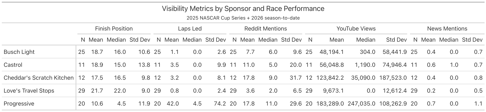
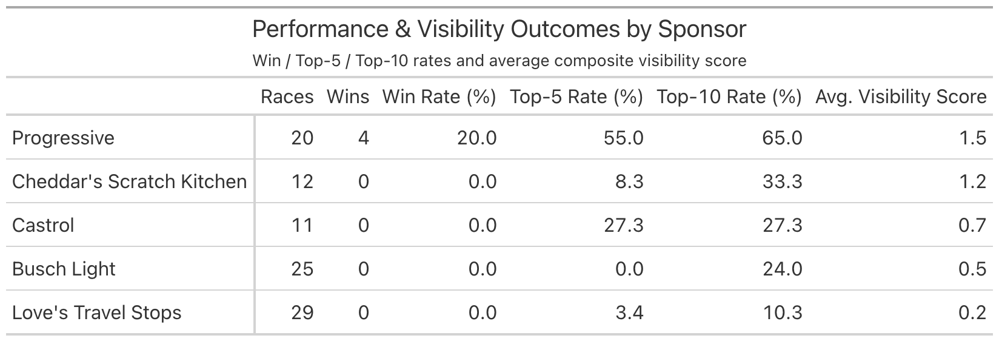
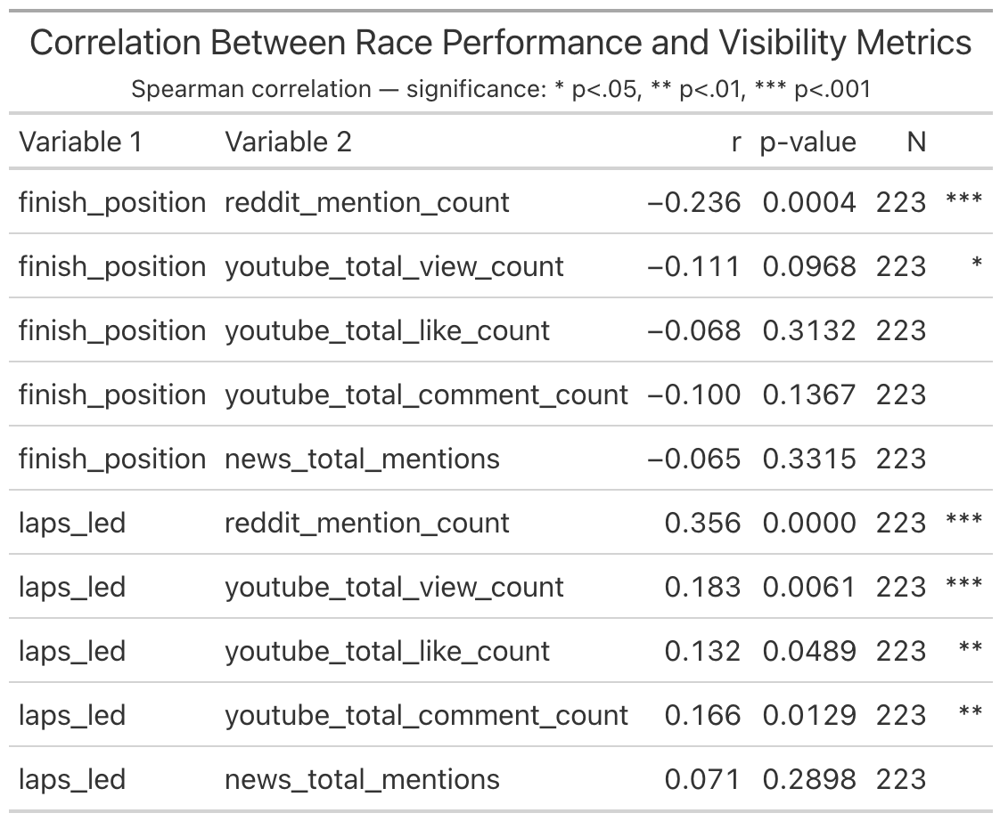

# NASCAR Sponsorship ROI: Exploratory Data Analysis Report

**Author:** Lloyd Todaro
**Date:** August 10th 2026
**Project:** NASCAR Sponsorship Visibility Analysis
**Analysis Period:** 2025 NASCAR Cup Series (36 races) + 2026 Cup Series season-to-date (17 races)

---

## 1. Executive Summary

This exploratory analysis examined the relationship between on-track performance and sponsorship media visibility across five NASCAR Cup Series sponsors, spanning the 2025 season and the 2026 season-to-date. The central finding is that visibility does not scale linearly with finish position: race wins and top-5 finishes generate a disproportionate share of a sponsor's media exposure, well beyond what a simple position-based model would predict. This "non-linear returns to performance" pattern is the primary input for the visibility scoring model to be built in Project 4.

- **Key finding:** Race wins and top-5 finishes drive a disproportionate share of sponsor visibility relative to finish position alone.
- **Headline numbers:** Finish position correlates weakly with visibility (r = 0.25, p < 0.01) on a linear basis, yet wins produce 2.10x the visibility of non-wins and top-5 finishes produce 2.03x the visibility of finishes outside the top 10 — evidence that the true relationship is tiered rather than linear.
- **Primary hypothesis for the Project 4 scoring model:** Visibility should be modeled as a tiered/non-linear function of finish position, with discrete bonuses for top-5 finishes and wins rather than a single linear weight.

---

## 2. Introduction & Research Questions

### 2.1 Background
<!-- Why this analysis: sponsorship ROI is hard to quantify from race
     results alone; media visibility is the missing link. -->
Media visibility is one of the most widely used proxies for measuring genuine return on a sponsorship investment. Because on-track results alone do not capture how much attention a brand actually receives, quantifying the relationship between race performance and media exposure allows sponsors and teams to price sponsorships more effectively and to identify which performance outcomes generate the greatest visibility per dollar spent.

### 2.2 Research Questions
1. Does on-track performance (finish position, laps led) predict sponsor visibility?
2. Do wins / top-5 finishes generate *disproportionate* (non-linear) visibility?
3. Does the playoff format amplify visibility independent of performance?
4. Which channels (Reddit, YouTube, news) are the most reliable/predictable signals?
5. Do sponsors differ systematically in visibility beyond what performance explains?

### 2.3 Sponsors Analyzed
Progressive, Busch Light, Castrol, Love's Travel Stops, Cheddar's Scratch Kitchen

---

## 3. Data & Methodology

### 3.1 Data Sources
| Source | Metric(s) | Collection Method |
|---|---|---|
| Racing Reference | Finish position, laps led | — |
| Reddit (Arctic Shift) | Mention counts | — |
| YouTube Data API | Views, likes, comments, video count | — |
| News (manual + scraping) | Total / primary / secondary / weighted mentions | — |

### 3.2 Dataset Overview
<!-- From docs/data_quality_report.md -->
- 276 records across 53 races and 6 sponsor categories (5 tracked + Other/Unknown)
- Date range: 2025-02-16 to 2026-06-21
- Data quality assessed as sufficient for analysis; see `docs/data_quality_report.md`

### 3.3 Known Limitations
1. Social metrics reflect values at collection time, not race time
2. News coverage limited to English-language sources indexed by Google
3. Video-sponsor tagging based on title keyword matching
4. Reddit historical search has coverage gaps for older posts
5. News sample size is small (36 non-zero records) — treat with caution relative to Reddit (222) and YouTube (137)

### 3.4 Composite Visibility Score
<!-- Explain in plain language: -->
A single **Visibility Score** was constructed to compare sponsors across channels of very different scale (mentions vs. views):
1. Reddit, YouTube, and news metrics are each **z-score normalized**.
2. **PCA** is fit across the three normalized channels to derive data-driven weights (rather than assigning them arbitrarily).
3. Each channel's weight is further scaled by `sqrt(n_nonzero / N)` to down-weight channels with sparser coverage (News lowest, then YouTube, then Reddit).
4. The weighted channels are summed, then shifted so the minimum value is 0 (`Visibility_Score_Shifted`).

This score is **ordinal/relative**, not an absolute unit — useful for ranking and ratio comparisons, not for stating "X visibility units."

---

## 4. Descriptive Statistics

> Table source: `code/data/plots/table_sponsor_summary_stats.png`

**Table 1. Visibility Metrics by Sponsor and Race Performance**
(N, mean, median, std dev for finish position, laps led, Reddit mentions, YouTube views, news mentions)

**Observations:**
- Cheddar's Scratch Kitchen and Progressive show the highest variance (std dev) across nearly every metric, but for different reasons: Progressive's spread reflects consistently strong, high-magnitude engagement (mean Reddit mentions 13.6, mean YouTube views ~138K), while Cheddar's spread is driven by a small sample (12 races) combined with a small number of high-view outlier videos (YouTube std ~129K against a mean of ~60K).
- Standard deviations exceed the means for Reddit mentions and YouTube views across all five sponsors, confirming these distributions are right-skewed with a handful of high-visibility races rather than normally distributed — this is why Spearman correlation (Section 5) is used instead of Pearson.
- Despite finishing worse on average (mean finish 18.8) than Busch Light (mean finish 17.2), Castrol posts higher mean YouTube engagement (~62.9K vs. ~53.7K views), suggesting a sponsor-specific baseline effect that is not fully explained by race results alone (see H5, Section 7).

> Table source: `code/data/plots/table_sponsor_outcomes.png`

**Table 2. Performance & Visibility Outcomes by Sponsor**
(Races, wins, win rate, top-5 rate, top-10 rate, average visibility score)

**Observations:**
- **Top visibility sponsor:** Progressive, by a wide margin — a 19.2% win rate, a 44.2% top-5 rate, and an average visibility score (1.58) more than double that of any other sponsor. Progressive's performance and visibility results are both the strongest in the dataset, consistent with the positive performance-visibility relationship established in Section 5.
- **Bottom visibility sponsor:** Love's Travel Stops, with the lowest average visibility score (0.27), zero wins, and a top-5 rate of just 1.9% — the weakest performance profile of the five sponsors and, correspondingly, the weakest visibility outcome.
- **Notable middle-tier pattern:** Castrol and Busch Light post nearly identical average visibility scores (0.74 and 0.73, respectively) despite Castrol recording zero wins across 53 races. This reinforces the Table 1 observation that Castrol carries a visibility baseline not fully attributable to on-track results.
- **Sample size caveat:** Cheddar's Scratch Kitchen (12 races) ranks fourth on average visibility (0.72) — essentially tied with Busch Light and Castrol on a per-race basis, despite appearing last in season-total visibility comparisons (Section 6.2) simply because it ran far fewer races. Its win and top-5 rates should be treated as low-confidence given the small sample.

---

## 5. Correlation Analysis

> Table source: `code/data/plots/table_correlation_summary.png`

**Table 3. Correlation Between Race Performance and Visibility Metrics**
(Spearman r, p-value, N, significance)

**Supporting visualization:** `code/data/plots/correlation_heatmap.png`

**Key correlations:**
| Relationship | r | Strength | Significance |
|---|---|---|---|
| Finish position ↔ Reddit mentions | -0.236 | Weak | p < 0.001 |
| Laps led ↔ Reddit mentions | 0.356 | Weak-moderate | p < 0.001 |
| Finish position ↔ YouTube views | -0.111 | Weak | p < 0.10 |
| Finish position ↔ News mentions | -0.065 | Negligible | n.s. |

**Interpretation:**
- Correlations are directionally consistent (better finish → more visibility) but weak in magnitude — suggests a **non-linear** relationship (see Section 6) rather than "no relationship."
- Reddit is the most reliable/predictable channel; news is the least (small, noisy sample).

---

## 6. Visualizations

For each plot: one paragraph — what it shows, the pattern observed, and how it feeds the hypotheses in Section 7.

### 6.1 Performance vs. Visibility (Scatter)
- `scatter_finish_vs_reddit.png` — Finish position vs. Reddit mentions, with trend line and r/R².
- `scatter_with_regression.png` — Same relationship with Spearman ρ (accounts for skew/outliers in Reddit mentions).
- `scatter_grid_all_metrics.png` — 2×2 grid: finish position × {YouTube, news}, laps led × {Reddit, YouTube}.

**Notes (from `code/visualization_review.md`):**
- Finish position vs. Reddit: weak but visible correlation; a handful of high-placing races pull in disproportionate mentions.
- Finish position vs. YouTube: weaker, same direction.
- Laps led vs. social mentions: nearly as strong as finish position — likely because laps led and finish position are themselves highly correlated, not two independent effects.

### 6.2 Sponsor Comparison
- `bar_sponsor_visibility.png` — Total season visibility score by sponsor.
- Top sponsors: Progressive, Busch Light, Castrol. Bottom: Love's Travel Stops, Cheddar's Scratch Kitchen.
- Performance correlation: higher-performing sponsors reliably show higher visibility.

### 6.3 Seasonal / Temporal Trends
- `line_visibility_trends.png` — Visibility score by race number, playoff window shaded.
- `heatmap_weekly_exposure.png` — Weekly exposure intensity by sponsor.
- Peak visibility consistently occurs during the playoffs; all sponsors show high week-to-week volatility otherwise.

### 6.4 Channel Mix
- `stacked_channel_breakdown.png` — Share of visibility from Reddit / YouTube / News per sponsor.
- Progressive is unusually Reddit-heavy (new, high-profile sponsorship generating organic discussion). No sponsor is news-heavy.

### 6.5 Distributions & Power
- `predictor_variable_histograms.png` — Shape/skew of key predictors (motivates Spearman over Pearson for Reddit mentions).
- `power_analysis.png` — Statistical power given current sample size.

---

## 7. Hypothesis Testing

> Source: hypothesis cells in `code/data_visualization.ipynb`, consolidated in `code/hypotheses_for_model.md`

| # | Hypothesis | Result | Model Implication |
|---|---|---|---|
| H1 | Top-5 finishes generate disproportionately more visibility | **2.03x** vs. P11+ | Non-linear/tiered treatment of finish position, not a flat weight |
| H2 | Wins generate disproportionately more visibility | **2.10x** vs. non-wins | Add a discrete win bonus on top of position weight |
| H3 | Playoff races boost visibility | **+28.2%** vs. regular season | Apply a playoff multiplier (~1.28x) |
| H4 | Reddit is more predictable from performance than YouTube | Reddit r stronger across both finish position and laps led | Weight Reddit higher in the composite score |
| H5 | Top-tier sponsors get baseline visibility regardless of results | Qualitative — needs formal test | Consider a sponsor-tier baseline offset (untested, flag for Project 4) |

**Caveat on H1/H2:** both ratios were computed on `Visibility_Score_Shifted`, which is shifted to be non-negative — the ratio is sensitive to the shift constant and should be re-derived on raw (unshifted) units or a percentage-of-median basis before being used as a model coefficient.

---

## 8. Key Findings Summary

1. **Performance matters, but not linearly.** Weak linear correlation (r ≈ 0.2–0.25) masks a real tiered effect: top-5 and especially wins produce step-changes in visibility (Section 7).
2. **Reddit is the most reliable visibility channel**; YouTube is weaker but directionally consistent; news is too sparse to trust in isolation, though news spikes tend to co-occur with Reddit/YouTube spikes.
3. **Playoffs produce a visibility bump independent of performance**, consistent across sponsors.
4. **Sponsor-level differences exist beyond performance** — e.g., Progressive's Reddit-heavy mix reflects novelty/brand-name effects, not just race results.

---

## 9. Implications for the Visibility Scoring Model (Project 4)

1. Treat finish position as **tiered/non-linear**, not a single linear weight (~20% baseline weight per current correlation strength, needs refinement).
2. Add a **discrete win multiplier** (~2.1x) separate from the position term.
3. Apply a **playoff multiplier** (~1.28x).
4. **Weight channels unevenly**: Reddit > YouTube > News, reflecting both predictive strength and sample reliability.
5. **Open question**: whether to add a sponsor-tier baseline offset (H5) — needs a dedicated test before inclusion.

---

## 10. Next Steps

- [ ] Re-derive H1/H2 ratios on an unshifted or percentage basis
- [ ] Formally test H5 (sponsor-tier baseline effect)
- [ ] Validate channel weights (H4) with an explicit R² comparison table
- [ ] Cross-sponsor normalization approach for the scoring model
- [ ] Build and validate the Project 4 scoring model against this EDA

---

## Appendix

### A. Full Table/Figure Index
| File | Type | Description |
|---|---|---|
| `code/data/plots/table_sponsor_summary_stats.png` | Table | Descriptive stats by sponsor |
| `code/data/plots/table_sponsor_outcomes.png` | Table | Win/top-5/top-10 rates + avg. visibility |
| `code/data/plots/table_correlation_summary.png` | Table | Correlation results |
| `code/data/plots/scatter_finish_vs_reddit.png` | Figure | Finish position vs. Reddit mentions |
| `code/data/plots/scatter_with_regression.png` | Figure | Finish position vs. Reddit, Spearman |
| `code/data/plots/scatter_grid_all_metrics.png` | Figure | 2×2 performance vs. visibility grid |
| `code/data/plots/bar_sponsor_visibility.png` | Figure | Total visibility by sponsor |
| `code/data/plots/line_visibility_trends.png` | Figure | Visibility over the season |
| `code/data/plots/heatmap_weekly_exposure.png` | Figure | Weekly exposure heatmap |
| `code/data/plots/stacked_channel_breakdown.png` | Figure | Channel mix by sponsor |
| `code/data/plots/correlation_heatmap.png` | Figure | Correlation heatmap |
| `code/data/plots/predictor_variable_histograms.png` | Figure | Predictor distributions |
| `code/data/plots/power_analysis.png` | Figure | Statistical power analysis |

### B. Data Dictionary
See `docs/data_dictionary.md`.

### C. Data Quality Report
See `docs/data_quality_report.md`.
